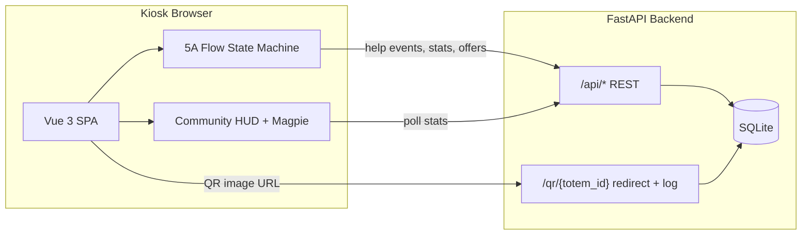

# Smokwit Totem — Architecture

Interactive kiosk prototype for smoking-cessation **5A** discussions (Ask → Advise → Assess → Assist → Arrange), built for HEG Arc / Neuchâtel context. This document explains how the system is structured for FYP review.

## High-level overview



| Layer | Role |
|-------|------|
| **Frontend (Vue 3)** | Step UI, pure flow model, session mood, community gauges |
| **Backend (FastAPI)** | REST API, QR tracking redirects, SQLite persistence |
| **Data files** | `offers.json`, `qr_destinations.json` (editable without redeploy) |

## Repository layout

```
FYP - off/
├── backend/
│   ├── app/
│   │   ├── api/          # REST routers (community, discussion, offers, quiz, qr)
│   │   └── core/         # config, db, security, observability, qr_destinations
│   ├── data/             # SQLite DB + JSON config (gitignored; use *.example.json)
│   └── tests/            # API contract tests
├── frontend/src/
│   ├── app/              # App shell, router
│   ├── features/
│   │   ├── discussion/   # 5A flow (pages, steps, model, composable, QrDisplay)
│   │   └── quiz/         # Standalone quiz + QR demo pages
│   ├── shared/           # config, services, state, shell components
│   ├── data/             # Frontend types + offer filter helpers
│   └── tests/            # Vitest unit tests (flow model, magpie, QR)
├── docs/                 # This file
└── scripts/              # bootstrap_data.ps1
```

### Why feature-based folders?

- **Discussion** owns everything about the 5A journey: steps, flow model, magpie mood, QR in context.
- **Shared** holds cross-cutting concerns (API client, community state, HUD, config).
- **App** is the thin shell: routing, sleep/wake overlay, stage layout.

This keeps step components close to the flow model and avoids a flat `pages/` tree with deep relative imports.

## 5A flow (frontend)

The discussion is driven by a **pure TypeScript state machine** in `features/discussion/flow/discussionFlowModel.ts`:

- **State:** current `StepId` + context (`agent` persona, `offerFilter`).
- **Commands:** `next`, `choice`, `pick`, `go`, `reset`.
- **Vue layer:** `useDiscussionFlow.ts` maps steps → Vue components and posts help events to the backend.

Steps follow clinical 5A naming:

| Phase | Steps |
|-------|--------|
| Attract | `Attract` |
| Ask | `A1` |
| Advise | `A2` |
| Assess | `A3`, `AssessApprox`, `AssessPrecise` |
| Assist | `AssistWithdrawal`, `AssistSupport`, `AssistPlan`, `AssistAppLink` |
| Arrange | `ArrangeOffersFiltred`, `ArrangeAppVersions`, `ArrangeQr` |
| Close | `Greetings`, `Bye` |

Unit tests in `frontend/src/tests/discussionFlowModel.test.ts` validate transitions without mounting Vue.

## Community HUD & magpie

Two gauges (8-hour rolling window, from backend):

| Gauge | Source | Formula |
|-------|--------|---------|
| 🫁 Respiration | `qr_scans` | `min(100, scans × 5%)` |
| ❤️ Support | `help_events` | `min(100, points / target × 100)` |

**LED tier** (magpie colour) follows **support %**:

- Red &lt; 31%
- Orange 31–70%
- Green ≥ 71%

**Session mood** (0–2) shifts magpie expression within a tier based on user choices; refusing help on A1 shows the green “sad” asset.

## Backend API (summary)

| Endpoint | Purpose |
|----------|---------|
| `GET /api/community/stats` | HUD gauges + scan counts |
| `POST /api/discussion/help-event` | Log assist/progress points |
| `GET /api/offers` | Cessation offers from JSON |
| `GET /api/quiz/questions` | Quiz bank |
| `POST /api/quiz/answer` | Score answer server-side |
| `GET /qr/{totem_id}` | Log scan, redirect to real URL |

QR destinations are configured in `backend/data/qr_destinations.json`. The frontend builds tracking URLs via `shared/config/qrDestinations.ts` (mirrors backend keys for display).

## Data bootstrap

`backend/data/` is gitignored. On a fresh clone:

```powershell
.\scripts\bootstrap_data.ps1
```

This copies `offers.example.json` and `qr_destinations.example.json` when the live files are missing.

## Known demo limitations (honest for FYP)

These are intentional or out of scope for the prototype:

- No real auth; kiosk assumes trusted local network.
- Dual QR config (frontend TS + backend JSON) — keeps QR images working offline in dev while redirects stay server-authoritative.

## Tests & CI

```powershell
# Frontend
cd frontend; npm run test; npm run build

# Backend (from repo root)
.\venv\Scripts\python.exe -m unittest discover -s backend/tests -p "test_*.py"
```

GitHub Actions (`.github/workflows/ci.yml`) runs both on push/PR.

## Demo script (5 min presentation)

1. **Attract** — touch to wake, community HUD visible (red/orange/green magpie from live stats).
2. **A1–A2** — show branching; note magpie mood shifts on supportive choices.
3. **A3 Assess** — RTQ vs approximate readiness paths.
4. **A4 Assist** — withdrawal / hesitant / ready branches + app link QR.
5. **A5 Arrange** — filtered offers from API, Smokwit map QR, HEG×UniNE variant.
6. **QR scan** — phone hits `/qr/TOTEM_001?agent=expert`, respiration gauge rises.
7. **Quiz** (`/quiz`) — optional secondary screen for engagement metrics.

## Build for single-process demo

```powershell
cd frontend; npm run build
# Copy dist to backend/static (or configure your deploy pipeline)
```

FastAPI serves the built SPA from `backend/static/` when present.
